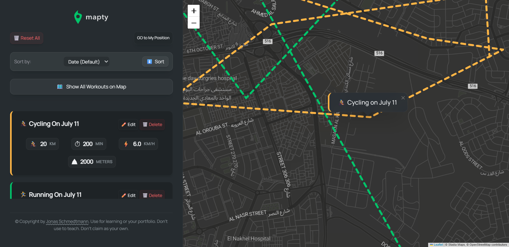
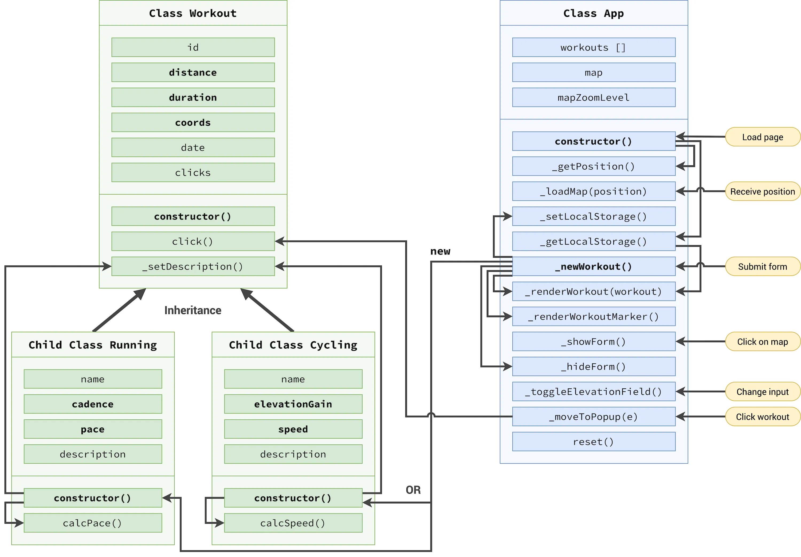
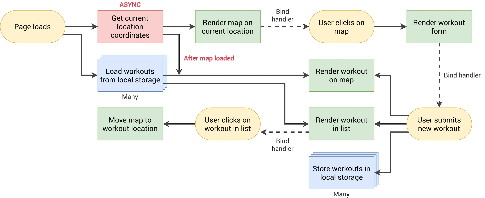

# 🗺️ Mapty v2 // Advanced Enterprise OOP Workout Tracker

## 💡 Original Concept & Acknowledgments

The core UI layout and concept of Mapty are inspired by the educational resources of **Jonas Schmedtmann**. This version represents a complete structural rewrite, migrating the logic to an advanced, highly modular enterprise architecture.

---

An advanced, production-grade refactoring of the Mapty application. This version architecture completely overhauls the standard blueprint, transforming it into a strict, highly optimized, and memory-safe **Object-Oriented Programming (OOP)** ecosystem built using modern development tools.

## 

## 🚀 Performance & Production Metrics

- **Live Demo:** [[Insert Deployed Link Here](https://ahmed-let-front.github.io/Mapty/)]
- **Google Lighthouse Score:** 💯 **400/400** (Perfect 100/100 across Performance, Accessibility, Best Practices, and SEO).

---

## 🏗️ Architectural Overhaul & SOLID Design

Unlike the baseline tutorial architecture, this codebase has been heavily re-engineered to strictly enforce the **S (Single Responsibility Principle) from SOLID**.



### 1. Granular Private Method Separation

Instead of monolithic functions handling multiple tasks, the architecture splits operations into deeply isolated **Private Methods (`#`)**:

- **UI vs. State Separation:** Creation, form handling, and modal displays are completely decoupled from state-level modifications.
- **Granular UI Control:** Dedicated methods like `#toggleInputState`, `#clearInputs`, `#updateWorkoutObject`, and `#dispalyNewDataWorkout` ensure that every function has exactly **one reason to change**.

### 2. Full ES6 OOP Framework & Inheritance Pipeline

The entire application operates as an encapsulated reactive system:

- `App Class`: Acts as the central event controller and runtime orchestrator.
- `Workout (Parent Class)`: Establishes the foundational physical data blueprint.
- `Running` & `Cycling` (Subclasses): Deeply inherit from the parent via `super()` while abstracting type-specific computational logic (`calcPace()` / `calcSpeed()`).

---

## 🧠 Advanced JavaScript Memory Management & Deep Dive

This project demonstrates an advanced understanding of the **V8 Engine Layout**, specifically how data interacts between the **Stack** and the **Heap**.

### 1. Exploiting "Pass-by-Reference" Behavior

In JavaScript, arrays and objects are stored in the Heap and manipulated via **References**. Because of this, when editing an item in the Dialog popup, the application locates the target instance inside the state array (`#workoutsArr`) using `.find()`.

Since variables store references to the _same_ memory location in the Heap, modifying `workoutObject` properties directly updates the instance inside the array instantly. There is **no need to explicitly re-push or overwrite the array item**—the structural mutation propagates automatically.

### 2. Memory-Safe LocalStorage Serialization Pipeline

To maintain a clean data lifecycle and avoid performance bottlenecks:

- **The Circular Reference Fix:** To bypass `TypeError: Converting circular structure to JSON`, the `#setItemInLoacalStorage` engine intercepts the save action. It uses a `.map()` callback to generate clean shallow copies (`{ ...workout }`) and strictly drops heavy runtime variables (`delete copy.polyline`) before encoding.
- **The Re-instantiation Flow:** On boot, the primitive JSON coordinate data is re-read by the **Public Geolocation API**, passing clean points back into the Leaflet constructor to rebuild active layers natively without memory clutter.
- **Garbage Collection Triggering:** Deletion completely severs the links. By stripping elements from the DOM (`.remove()`), removing the Leaflet layer (`polyline.remove()`), and filtering out the target from `#workoutsArr`, the object loses all references across the execution context, prompting the JavaScript **Garbage Collector** to immediately free up space in the RAM.

---

## 🗺️ Visualizing the System Runtime Flow



The system map follows a continuous, optimized cycle:

1. **User Event (Click/Submit)** ➡️
2. **State Mutation (Pass-by-Reference in Array)** ➡️
3. **UI Pipeline Notification (DOM & Layer Rendering)** ➡️
4. **Serialization Filter (Circular Reference Stripping)** ➡️
5. **Storage Sync (`localStorage`)**.

---

## 🛠️ Tech Stack & Implementation Details

- **Core Language:** JavaScript (ES6+ Strict OOP Paradigm)
- **API Integration:** Native Browser Geolocation API & Leaflet.js Mapping Library
- **Styles & Layout:** **Tailwind CSS v4.x** (Utilizing advanced CSS-first configuration and fluid utility styling)
- **Bundler & Build Tool:** Vite (Optimized production asset splitting)

---

## 📦 Project Initialization & Local Setup

This project was built from scratch using a modern frontend workflow. Here is how the environment was initialized and structured:

### 1. Environment Initialization

The project environment was scaffolded using **Vite** and configured with **Tailwind CSS v4** and **Leaflet**:

```bash
# 1. Initialize the project with Vite
npm create vite@latest . -- --template vanilla

# 2. Install dependencies (Tailwind v4, Leaflet, and GitHub Pages for deployment)
npm install tailwindcss @tailwindcss/vite leaflet gh-pages

# 3. Start the local development server
npm run dev
```

### 2. Version Control & Git Setup

To track the architecture development and link it to GitHub:

```bash
# Initialize local Git repository
git init

# Stage all architectural files
git add .

# Commit the initial clean setup
git commit -m "feat: initial safe OOP architecture setup with Tailwind v4"

# Link to your remote GitHub repository
git remote add origin [https://github.com/ahmed-let-front/Mapty]

# Push to the main branch
git branch -M main
git push -u origin main
```

### 3. Production Deployment Pipeline

The application uses the gh-pages engine to build and bundle static assets dynamically:

```bash
# Deploy the production build to GitHub Pages
npm run deploy
```

---

## ⚙️ Vite Build Configuration (`vite.config.js`)

To guarantee a high-performance build process and achieve a perfect Google Lighthouse score, a custom Vite configuration was designed to handle chunk splitting, asset optimization, and asset hashing:

```javascript
import { defineConfig } from 'vite';
import tailwindcss from '@tailwindcss/vite';

export default defineConfig({
  plugins: [tailwindcss()],
  base: '/Mapty/', // Core production path for GitHub Pages deployment
  build: {
    sourcemap: false, // Disabled in production to compress build size and shield source code
    rollupOptions: {
      output: {
        // Strict file caching busting using hashes
        assetFileNames: 'assets/[name]-[hash][extname]',
        chunkFileNames: 'assets/[name]-[hash].js',
        entryFileNames: 'assets/[name]-[hash].js',

        // Advanced Manual Chunk Splitting (Vendor Splitting)
        manualChunks(id) {
          if (id.includes('node_modules')) {
            return 'vendor'; // Segregates heavy external tools (e.g., Leaflet) from core app logic
          }
        },
      },
    },
  },
});
```

### Thanks **by UIO** ❤️
